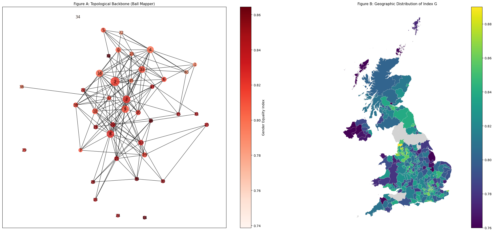

UK Gender Equality Index: A Topological Data Analysis (TDA)
This project explores the Gender Equality Index across different Local Administrative Districts (LADs) in the UK. By combining traditional statistical methods (Linear Regression, Correlation) with Topological Data Analysis (Ball Mapper), we visualize the backbone of gender equality and identify regional outliers.

📊 Key Features
Correlation Analysis: Examining relationships between 19 indicators (Work, Money, Power, Health, Education) and the final Index_G.

Outlier Detection: Automated identification of regions that deviate from national trends using regression residuals.

Topological Mapping: Using the Ball Mapper algorithm to cluster regions based on multi-dimensional similarity rather than just geography.

Geospatial Visualization: Comparative views between topological structures and UK geographical maps.

📂 Project Structure
Topological_Analysis.ipynb: The main notebook containing the full pipeline.

GEIUK indicators.xlsx: Raw indicators for each district.

GEIUK scores, deciles.xlsx: Calculated scores and cluster labels.

LAD_MAY_2024_UK_BFE.shp: Shapefile for UK geographical mapping.
